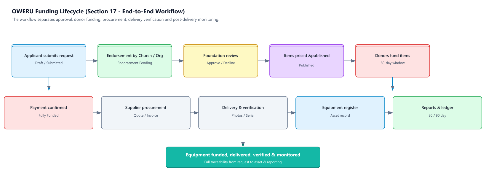
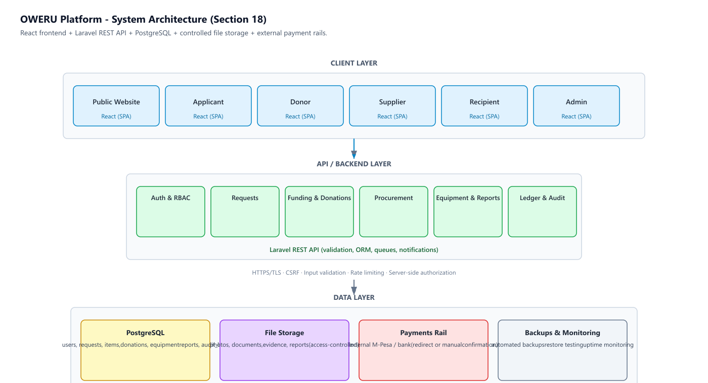

# OWERU Foundation
## Phase One Outreach Equipment Funding Platform
### Software Requirements Specification (SRS) & System Design

---

**Document Control**

| Field | Value |
|---|---|
| Document | Phase One Outreach Equipment Funding Platform – SRS & System Design |
| Client | OWERU Foundation |
| Prepared by | Azizi Ally |
| Version | 1.0 – Discussion Draft |
| Date | 28 August 2026 |
| Purpose | Requirements validation, system design, development quotation and implementation planning |

> **Important Note**
> This document combines the original Phase One SRS with clarified functional requirements, roles, workflows, use cases, database/ERD design, architecture, security, UI structure, dashboard requirements, acceptance criteria and a phased implementation roadmap. It should be reviewed and approved jointly by OWERU Foundation and the development team before production development begins.

---

## 1. Executive Summary

OWERU Foundation requires a transparent digital platform for funding outreach equipment rather than providing cash grants. The system will allow approved outreach requests to be presented publicly, break each request into individually fundable equipment items, record donor contributions, coordinate suppliers, maintain an equipment register, collect post-delivery reports and publish a transparent public ledger.

- **No cash transfers** to applicants or recipients.
- Every applicant must be **endorsed by a recognised church or organisation** before Foundation review.
- Donors fund approved equipment items individually using an **all-or-nothing model** within a **60-day funding window**.
- Suppliers **invoice the Foundation directly**.
- Delivery requires **verification**, including photographic evidence and serial numbers where applicable.
- Equipment remains **owned by the Foundation for 24–36 months** before possible transfer.
- Public information must respect **privacy and safeguarding controls**.
- Public-facing content must support **English and Swahili**.

---

## 2. Business Objectives

1. Increase transparency in how outreach equipment funding is requested, funded and delivered.
2. Prevent misuse of funds by ensuring the Foundation purchases equipment directly.
3. Create a traceable record from request through procurement, delivery and reporting.
4. Give donors a clear view of individual funding opportunities and progress.
5. Create an operational equipment register for ownership, warranty and status tracking.
6. Improve safeguarding and privacy by controlling what applicant information becomes public.
7. Provide reliable reports and statistics for Foundation management and board reporting.

---

## 3. Scope

### 3.1 In Scope – Phase One

- Public bilingual website.
- Approved funding requests and individual equipment funding pages.
- Funding request intake and admin review.
- Endorsement tracking.
- Donor funding records and payment-reference tracking.
- Supplier, quotation and invoice records.
- Equipment register.
- Delivery verification.
- 30-day, 90-day and incident reporting.
- Public funding ledger.
- Privacy and safeguarding controls.
- Role-based access control and audit logging.
- Admin dashboard and basic reporting/export.

### 3.2 Out of Scope – Phase One

- Cash grants, stipends or salaries.
- Funding of buildings or construction.
- Child-focused activities.
- Custom payment-processing engine or holding donor funds inside the platform.
- Full native mobile application.
- Advanced analytics and predictive reporting.
- Large-scale automated procurement.

---

## 4. Funded and Non-Funded Categories

| Category | Examples |
|---|---|
| **Funded** | Sound systems, speakers, amplifiers, microphones, generators, solar kits, Bibles, tracts, tents, chairs, transport via ticket/hire/fuel account |
| **Not Funded** | Cash payments, stipends, salaries, buildings, child-focused work, ongoing/recurring operating costs |

---

## 5. Stakeholders and User Roles

| Role | Main Responsibilities | Access Level |
|---|---|---|
| Applicant | Submit/track request, choose exposure level, provide supporting information | Own records only |
| Endorsing Church / Organisation | Verify applicant, endorse request, support follow-up | Endorsements and assigned requests |
| Foundation Admin | Review, approve, publish, manage donors, suppliers, payments, equipment, reports and ledger | Full administrative access |
| Donor | Browse approved items, initiate funding, view own donation history | Public + own donor records |
| Supplier | Provide quotes/invoices, confirm delivery and warranty information | Assigned supplier records |
| Recipient | Confirm receipt/use, submit required reports and incidents | Assigned equipment/report records |

---

## 6. Functional Requirements

| ID | Area | Requirement |
|---|---|---|
| FR-01 | Public Website | System shall provide Home, About, Approved Requests, Funding Details, Public Ledger, Reports/Stories, Safeguarding, Privacy and Complaints pages. |
| FR-02 | Bilingual Content | Public pages shall support English and Swahili, with a language switcher. |
| FR-03 | Request Submission | System shall capture funding request details and supporting documents. |
| FR-04 | Endorsement | A request shall not enter Foundation review as eligible unless the required endorsement is recorded. |
| FR-05 | Review | Admin shall mark requests Approved, Declined or More Information Needed and record a decision note. |
| FR-06 | Itemisation | Approved requests shall be broken into individual equipment items with descriptions, prices and funding targets. |
| FR-07 | Funding Window | Each fundable item shall have a 60-day funding window and all-or-nothing status. |
| FR-08 | Donation Tracking | System shall record donor, item, amount, date, payment reference and confirmation status. |
| FR-09 | Supplier Management | System shall maintain suppliers, quotes, invoices, delivery and warranty records. |
| FR-10 | Direct Supplier Payment | Supplier payment shall be recorded against the Foundation and never as a cash transfer to the applicant. |
| FR-11 | Delivery Verification | Admin shall verify delivery using required evidence, including photos/serial numbers where applicable. |
| FR-12 | Equipment Register | System shall maintain register number, item/model, serial number, supplier, invoice, amount, recipient, location, dates and status. |
| FR-13 | Reporting | System shall support delivery, 30-day, 90-day and incident reports with media attachments. |
| FR-14 | Privacy | System shall enforce Open, Partial and Protected exposure levels. |
| FR-15 | Public Ledger | System shall publish approved transparency data while suppressing protected personal information. |
| FR-16 | Notifications | System shall generate notifications for key workflow events and overdue reports. |
| FR-17 | Audit | System shall log approvals, payments, edits, status changes and other sensitive actions. |
| FR-18 | Exports | Admin shall export relevant reports/data for board and operational reporting. |

---

## 7. Request Status Model

| Status | Meaning | Typical Next Action |
|---|---|---|
| Draft | Application not yet submitted | Applicant completes and submits |
| Submitted | Application received | Check endorsement/completeness |
| Endorsement Pending | Required endorsement not yet confirmed | Church/organisation endorses |
| Under Review | Admin is assessing request | Approve, decline or request information |
| More Information Needed | Additional evidence required | Applicant provides information |
| Approved | Request accepted by Foundation | Create/pricelist items |
| Published | Approved items are visible for funding | Donors fund items |
| Funding Closed | Funding window expired or completed | Procurement decision |
| Procurement | Supplier/order process underway | Delivery |
| Delivered | Equipment received | Verify evidence and register item |
| Active / Reporting | Equipment in use and reports being collected | 30/90-day monitoring |
| Closed | Lifecycle completed | Archive/report |

---

## 8. Item and Equipment Status Model

| Status | Meaning |
|---|---|
| Pending Funding | Item is published but target not reached |
| Fully Funded | Target amount reached |
| Ordered | Procurement/order initiated |
| Delivered | Supplier delivered item |
| Verified | Delivery evidence and required checks completed |
| In Use | Equipment actively used |
| In Repair | Equipment temporarily unavailable for repair |
| Returned | Equipment returned to Foundation |
| Transferred | Ownership transferred after approved period |
| Lost | Equipment reported lost |

---

## 9. Donor Funding and Payment Flow

1. Donor browses approved requests.
2. Donor opens an individual equipment item.
3. Donor sees target amount, current progress, remaining amount and funding deadline.
4. Donor selects the amount to contribute.
5. System provides/redirects to the Foundation's approved payment rail or payment instructions.
6. Payment reference is recorded.
7. Admin or approved integration confirms payment.
8. Donation status becomes Confirmed and the item's progress is updated.
9. When the item's target is reached, the item becomes Fully Funded and moves to procurement.

> **Phase One decision required:** confirm whether payment will be **(A)** external redirect/integration with return reference, or **(B)** donor payment followed by manual admin confirmation. The choice affects integration scope and cost.

---

## 10. Supplier and Procurement Workflow

1. Admin creates/selects an approved supplier.
2. Supplier quote is attached to the relevant equipment item.
3. Admin approves the selected quote.
4. Purchase/order is recorded.
5. Supplier submits invoice to OWERU Foundation.
6. Supplier delivers equipment.
7. Admin verifies delivery and required evidence.
8. Serial number and equipment details are entered into the register.
9. Foundation payment to supplier is recorded.
10. Warranty details and warranty expiry are stored.

---

## 11. Reporting Workflow

| Report | Due/Trigger | Required Information |
|---|---|---|
| Delivery Report | After delivery | Date, item, serial number, recipient confirmation, photos/evidence |
| 30-Day Report | 30 days after delivery | Active use confirmation, condition, usage summary, photos if required |
| 90-Day Report | 90 days after delivery | Continued use, impact/outcomes, supporting photos/videos |
| Incident Report | Whenever loss/theft/damage occurs | Incident date, description, action taken, evidence |

Overdue reports should create follow-up tasks/notifications. Repeated non-compliance should be recorded and may affect future eligibility.

---

## 12. Privacy and Safeguarding Design

| Exposure Level | Public Information | Restricted Information |
|---|---|---|
| Open | Name/organisation or approved public identity, broad region/district, request story and funding information as approved | Phone, national ID, exact household/village location and other sensitive data |
| Partial | Limited name/organisation, region/district and request information | Direct contact details and sensitive identity/location information |
| Protected | Minimal public identity; project/request information only where approved | All direct personal identifiers and precise locations |

**Safeguarding rules:**
- Phone numbers must never appear on public pages.
- National ID numbers must never appear publicly.
- Exact household/village locations must never appear publicly.
- Public pages should use region/district where location is necessary.
- Uploaded documents must be access-controlled and not publicly exposed by default.
- Admins should only see sensitive information when required for their role.

---

## 13. Public Website Structure

| Page | Purpose | Key Components |
|---|---|---|
| Home | Introduce OWERU and direct visitors to funding opportunities | Mission, impact, CTA, featured requests |
| About | Explain Foundation and programme | History, mission, principles |
| Approved Requests | Browse funding opportunities | Filters, categories, progress |
| Funding Details | Fund an individual equipment item | Target, progress, deadline, description, fund CTA |
| Public Ledger | Transparency | Supplier, amount, dates, status, approved public fields |
| Reports & Stories | Show impact | Reports, stories, media |
| Safeguarding | Explain safeguarding commitments | Policy and reporting route |
| Privacy Notice | Explain data handling | Privacy policy |
| Complaints | Receive concerns | Secure complaint form/contact route |

---

## 14. Authenticated UI Structure

| Portal | Pages / Functions |
|---|---|
| Applicant | Dashboard, New Request, My Requests, Documents, Endorsement Status, Reports, Privacy Settings, Notifications |
| Donor | Dashboard, Browse Items, Donation History, Payment References, Receipts/Confirmations, Profile |
| Supplier | Dashboard, Assigned Items, Quotes, Invoices, Delivery Submission, Warranty Records |
| Recipient | My Equipment, Delivery Confirmation, 30-Day Report, 90-Day Report, Incident Report |
| Admin | Dashboard, Requests, Endorsements, Items, Donations, Payments, Suppliers, Quotes, Invoices, Equipment, Reports, Ledger, Users, Settings, Audit Logs |

---

## 15. Admin Dashboard Requirements

- Summary cards: active requests, items awaiting funding, funded items, procurement items, overdue reports and registered equipment.
- Funding analytics: target vs funded, successful/expired items, donor totals.
- Request review queue with filters by status, date, region and category.
- Supplier and procurement management.
- Equipment register with search, filters and lifecycle status.
- Report monitoring with due dates and overdue flags.
- Public ledger management and publication controls.
- User and role management.
- Audit log viewer.
- CSV/Excel export for operational and board reporting.

---

## 16. High-Level Use Cases

| Use Case | Primary Actor | Outcome |
|---|---|---|
| UC-01 Submit Funding Request | Applicant | Request is stored for endorsement/review |
| UC-02 Endorse Request | Church/Organisation | Endorsement is recorded |
| UC-03 Review Request | Admin | Request approved, declined or returned |
| UC-04 Publish Funding Item | Admin | Approved item becomes publicly fundable |
| UC-05 Fund Item | Donor | Donation/payment reference is recorded |
| UC-06 Manage Supplier | Admin/Supplier | Quote/invoice and supplier records maintained |
| UC-07 Confirm Delivery | Admin/Recipient | Equipment delivery verified |
| UC-08 Register Equipment | Admin | Equipment enters official register |
| UC-09 Submit Report | Recipient | Required monitoring report stored |
| UC-10 Publish Ledger | Admin/System | Transparency information becomes public |

---

## 17. End-to-End Workflow Diagram

The workflow intentionally separates approval, donor funding, procurement, delivery verification and post-delivery monitoring so that the Foundation maintains control over funded equipment.

---

## 18. System Architecture

Recommended architecture: **React** frontend, **Laravel** API/backend, **PostgreSQL** database, controlled file storage, cloud hosting and external payment rails.

---

## 19. Database / ERD – Logical Design

The following logical entities should be considered for the production database. The final physical schema should be reviewed after the client confirms workflow and payment details.

| Entity | Important Fields | Relationships |
|---|---|---|
| users | id, name, email/phone, password, role, status | Has requests, donations, reports and audit actions |
| organizations | id, name, type, region, contact, verification_status | Endorses requests; may be linked to applicants/recipients |
| requests | id, applicant_id, organization_id, status, region, exposure_level, submitted_at | Has many request_items and documents |
| endorsements | id, request_id, organization_id, endorser, status, date, notes | Belongs to request and organisation |
| request_items | id, request_id, description, category, target_amount, funding_deadline, status | Has donations, quote, invoice and equipment record |
| suppliers | id, name, contact, verification_status | Has quotes/invoices/items |
| quotes | id, item_id, supplier_id, quote_number, amount, valid_until, document | Belongs to item and supplier |
| invoices | id, item_id, supplier_id, invoice_number, amount, status, document | Tracks supplier invoice/payment |
| donations | id, item_id, donor_id, amount, payment_reference, status, donated_at | Belongs to donor and item |
| payments | id, donation_id/invoice_id, reference, amount, method, status, confirmed_at | Tracks payment confirmations |
| deliveries | id, item_id, delivered_at, verified_at, evidence, verified_by | Delivery evidence and verification |
| equipment | id, item_id, register_number, model, serial_number, status, recipient_id, delivery_date, transfer_date | Operational asset record |
| reports | id, item_id, recipient_id, type, due_date, submitted_at, status, content | Delivery/30-day/90-day/incident |
| attachments | id, owner_type, owner_id, file_path, type, visibility | Controlled documents/media |
| privacy_settings | id, user_id, exposure_level, public_fields | Controls public exposure |
| notifications | id, user_id, type, message, read_at | Workflow alerts |
| audit_logs | id, user_id, action, entity, entity_id, old_value, new_value, created_at | Immutable audit history |

---

## 20. Core Relationships (Text ERD)

- User **1—M** Requests
- Organization **1—M** Endorsements
- Request **1—M** Request Items
- Request Item **M—1** Supplier (through Quotes/Procurement)
- Request Item **1—M** Donations
- Donation **1—1/Many** Payment Records as required by the chosen payment model
- Request Item **1—1** Equipment Record after delivery
- Equipment **1—M** Reports
- Any major entity **1—M** Attachments where applicable
- User **1—M** Notifications
- User **1—M** Audit Logs

---

## 21. Recommended Database Constraints

- Unique user email/phone where used for authentication.
- Unique equipment register number.
- Serial number should be unique where applicable.
- Donation amounts must be positive and validated against item funding rules.
- A funding item cannot accept contributions after closure unless an admin-authorised exception is explicitly defined.
- Sensitive fields should be encrypted or strongly access-controlled where appropriate.
- Audit logs should not be editable by ordinary administrators.
- Foreign-key relationships should prevent deletion of critical financial/equipment history.

---

## 22. Security Requirements

- HTTPS/TLS across all production traffic.
- Secure password hashing and session/token management.
- Role-based access control (RBAC).
- Server-side authorization checks for every protected operation.
- CSRF protection where session-based authentication is used.
- Input validation and output encoding.
- Protection against SQL injection through parameterized ORM/database queries.
- File upload restrictions: size, MIME/type validation, secure storage and access control.
- Rate limiting on login, password reset and sensitive endpoints.
- Audit logging for sensitive actions.
- Regular automated backups and tested restoration procedures.
- Least-privilege access for admin and supplier accounts.
- No sensitive personal data in public URLs or public API responses.

---

## 23. Non-Functional Requirements

| Area | Requirement |
|---|---|
| Performance | Normal public pages should load quickly under expected Phase One traffic; API operations should normally respond within a few seconds. |
| Availability | Use reliable cloud hosting with monitoring and backup procedures. |
| Scalability | Design should allow growth beyond the first 50 equipment records without redesigning core entities. |
| Usability | Responsive UI for desktop, tablet and mobile browsers. |
| Accessibility | Readable typography, keyboard-friendly controls, labels and accessible colour contrast. |
| Maintainability | Modular codebase, documented API and database migrations. |
| Localization | English and Swahili content architecture should avoid hard-coded text. |
| Auditability | Financial and asset lifecycle actions must be traceable. |
| Backup | Regular database and file backups with recovery testing. |

---

## 24. Notifications

| Event | Recipient | Priority |
|---|---|---|
| Request submitted | Admin | High |
| Endorsement required/completed | Applicant/Admin | High |
| More information requested | Applicant | High |
| Request approved/declined | Applicant | High |
| Item published | Donor/Public | Normal |
| Funding target reached | Admin/Relevant users | High |
| Delivery due | Supplier/Admin | High |
| Delivery verified | Admin/Recipient | Normal |
| 30-day report due | Recipient/Admin | High |
| 90-day report due | Recipient/Admin | High |
| Report overdue | Recipient/Endorsing organisation/Admin | High |
| Incident submitted | Admin | Critical |

---

## 25. Reports and Analytics

- Total requests by status.
- Funding target vs actual confirmed funding.
- Funding success rate and expired items.
- Donations by period and item/category.
- Supplier spending and payment status.
- Equipment by status, region and recipient.
- Upcoming and overdue reports.
- Incidents by type and status.
- Equipment approaching 24–36 month ownership/transfer milestone.
- Exportable board-report summary.

---

## 26. Phase One Launch Requirements

- Launch with approximately 5–8 already endorsed and priced requests.
- Public bilingual website operational.
- Approved funding pages operational.
- Public ledger operational.
- Basic donor funding flow operational.
- Equipment register can initially be spreadsheet-backed for the first 50 items if the client chooses a lightweight launch.
- Application intake can begin with paper/WhatsApp while the full online workflow is finalised, but the database structure should be ready for later migration.
- Safeguarding, privacy and complaints information must be published before launch.

---

## 27. Acceptance Criteria for Phase One

| ID | Acceptance Test |
|---|---|
| AC-01 | Visitor can switch between English and Swahili on public pages. |
| AC-02 | Only approved requests/items appear as public funding opportunities. |
| AC-03 | Each item displays target, funded amount, remaining amount and funding status. |
| AC-04 | An item cannot be treated as approved merely because a donor attempts to fund it. |
| AC-05 | Admin can record and verify payment references. |
| AC-06 | Supplier invoices are linked to the Foundation/item and payment status is traceable. |
| AC-07 | Equipment record contains register number and required lifecycle fields. |
| AC-08 | Public pages never expose phone numbers, national IDs or exact protected locations. |
| AC-09 | Delivery, 30-day, 90-day and incident reports can be stored and tracked. |
| AC-10 | Overdue reports are visible to authorised admin users. |
| AC-11 | Sensitive admin actions are present in the audit log. |
| AC-12 | Admin can export operational/board reporting data. |

---

## 28. Proposed Technology Stack

| Layer | Recommended Technology | Reason |
|---|---|---|
| Frontend | React | Responsive, component-based UI and strong bilingual architecture |
| Backend | Laravel (PHP) | Fast development, authentication, validation, ORM, queues and admin/API capabilities |
| Database | PostgreSQL | Strong relational integrity and scalability |
| File Storage | Cloud/object storage | Secure media/document storage |
| Hosting | Cloud VPS/managed cloud | Reliability, backups and scalability |
| Payments | Existing local payment rails | Avoid custom payment engine in Phase One |
| Version Control | Git + GitHub/GitLab | Source control and collaboration |

Alternative backend options from the original SRS—Node.js or Spring Boot—remain technically possible. Laravel + React is recommended here because it keeps the Phase One stack relatively simple and is well suited to form-heavy workflows, role-based administration and relational data.

---

## 29. Development Phases

| Phase | Main Deliverables |
|---|---|
| Phase 1 – Foundation | Project setup, database, authentication, roles, public website, bilingual structure |
| Phase 2 – Funding | Requests, endorsement, approval, itemisation, funding pages, donation/payment-reference flow |
| Phase 3 – Operations | Suppliers, quotes, invoices, delivery verification, equipment register |
| Phase 4 – Reporting | 30/90-day reports, incident reporting, notifications, overdue tracking |
| Phase 5 – Transparency & Admin | Public ledger, analytics, exports, audit logs, dashboard refinement |
| Phase 6 – Testing & Launch | Security testing, user acceptance testing, training, deployment and documentation |

---

## 30. Phased Product Roadmap

| Release | Scope |
|---|---|
| Phase One | Public website, basic funding flow, initial equipment register, public ledger |
| Phase Two | Full supplier management, structured reports, donor dashboards, notifications |
| Phase Three | Advanced analytics, mobile app, deeper payment integration, automation |

---

## 31. Key Client Decisions Required Before Coding

1. Confirm the exact legal/operational meaning of the 24–36 month Foundation ownership period.
2. Confirm the approved payment rail(s) and whether Phase One uses redirect/integration or manual payment confirmation.
3. Confirm whether donors need accounts or may donate as guests.
4. Confirm whether anonymous donor display is allowed.
5. Confirm exactly what donor receipts/acknowledgements should contain.
6. Confirm the official endorsement process and who is authorised to endorse.
7. Confirm whether applicants and recipients are always the same person/organisation.
8. Confirm the required public ledger fields and publication timing.
9. Confirm the exact safeguarding/complaints process and responsible contact.
10. Confirm who can approve supplier payments and what approval evidence is required.
11. Confirm whether spreadsheet equipment records will be migrated into the platform at launch or later.

---

## 32. Risks and Mitigations

| Risk | Impact | Mitigation |
|---|---|---|
| Unclear payment workflow | High | Decide payment model before integration/development |
| Sensitive information exposed publicly | Critical | Privacy-by-design, field-level access rules and public DTO/view models |
| Fake/invalid endorsements | High | Verified organisation records and endorsement audit trail |
| Unverified supplier/delivery | High | Approved supplier list + delivery evidence + admin verification |
| Overdue reports | Medium/High | Automated reminders and escalation through endorsing organisation |
| Data loss | Critical | Automated backups + restore testing |
| Scope creep | High | Freeze Phase One requirements and use roadmap for later features |

---

## 33. Final System Workflow Summary

Applicant submits → endorsement confirmed → Foundation review → request approved → items priced → funding page published → donors fund items → payment confirmed → item fully funded → supplier procurement → delivery → verification → equipment register → 30-day report → 90-day report → incident handling where necessary → public ledger and board reporting.

---

## 34. Conclusion

The proposed OWERU Foundation Phase One platform is designed as a controlled, transparent equipment-funding system rather than a cash-disbursement platform. Its core value is the traceability of each funded item from application and endorsement through donor funding, supplier procurement, delivery, asset registration and post-delivery reporting. The system should be implemented incrementally, beginning with a focused public website and essential operational workflows, while keeping the database and architecture ready for later automation.

---

## 35. Approval and Sign-Off

This document is a discussion draft. The final scope should be agreed jointly before development and quotation are considered final.

| Party | Name | Signature | Date |
|---|---|---|---|
| OWERU Foundation Representative | | | |
| Development Lead – Azizi Ally | | | |
